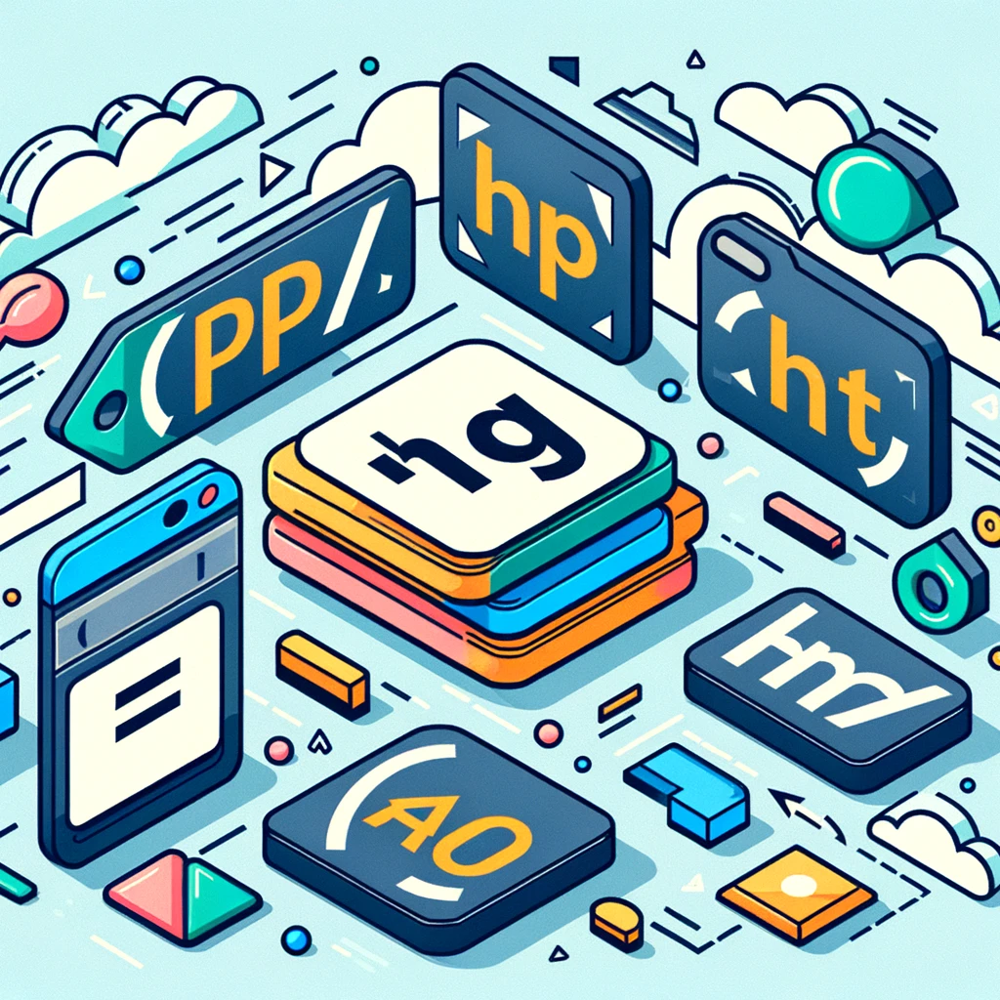
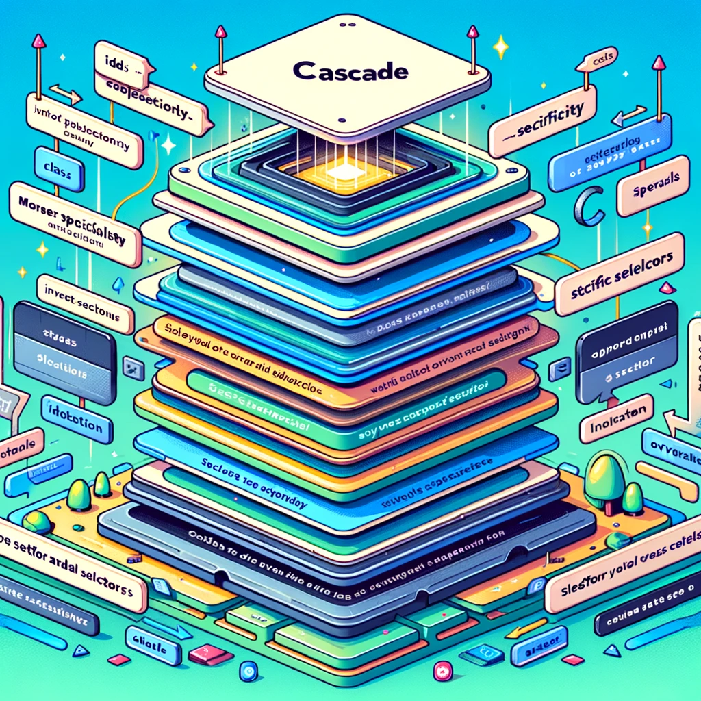

# Introducción a HTML y CSS

Bienvenidos a la guía básica de HTML y CSS, las piedras angulares del desarrollo web. Este documento te proporcionará una comprensión fundamental de cómo estas dos tecnologías trabajan juntas para crear la web como la conocemos.

## HTML: El Esqueleto de la Web

HTML, o Lenguaje de Marcado de Hipertexto, es la base de cualquier página web. Permite estructurar el contenido y darle significado mediante etiquetas específicas.

### Características Clave:

- **Etiquetas:** HTML utiliza "etiquetas" para marcar el inicio y el fin de los elementos en la página. Por ejemplo, `<p>` para párrafos, `<h1>` para títulos principales, `` para imágenes, etc.
- **Atributos:** Las etiquetas pueden incluir atributos para proporcionar información adicional, como el `src` en ``, que indica la fuente de la imagen.
- **Estructura:** Un documento HTML típicamente tiene una estructura básica que incluye `<doctype>`, `<html>`, `<head>`, y `<body>`.

## CSS: Vistiendo la Web

CSS, o Hojas de Estilo en Cascada, es lo que usa la web para aplicar estilos y hacer que el contenido sea visualmente atractivo.

<p align="center">
    
</p>

### Características Clave:

- **Selectores:** CSS utiliza selectores para aplicar estilos a los elementos HTML. Pueden ser nombres de etiquetas, clases, ID, o incluso selectores más avanzados basados en atributos o relaciones entre elementos.
- **Propiedades:** Cada selector puede contener una o más propiedades que definen cómo se debe mostrar un elemento, como `color`, `font-size`, `margin`, `padding`, etc.
- **Responsive Design:** Con CSS, podemos crear diseños que se adaptan a diferentes tamaños de pantalla, utilizando técnicas como media queries.

## Trabajando Juntos

HTML y CSS trabajan mano a mano: HTML forma la estructura y el contenido de la página, mientras que CSS define el estilo y la presentación. Al combinar estas tecnologías, puedes crear páginas web que no solo son informativas y fáciles de usar, sino también atractivas y adaptativas.

### Ejemplo Simple:

```html
<!DOCTYPE html>
<html>
<head>
    <title>Mi Página Web</title>
    <style>
        body { font-family: Arial, sans-serif; }
        h1 { color: blue; }
        p { color: darkgray; }
    </style>
</head>
<body>

<h1>¡Bienvenidos a mi página web!</h1>
<p>Esta es una introducción básica a HTML y CSS.</p>

</body>
</html>
```

# Conceptos Avanzados de HTML y CSS

Este documento profundiza en conceptos específicos de HTML y CSS que son cruciales para el diseño y desarrollo web efectivo. Al entender estos conceptos, podrás crear sitios web que no solo se vean bien, sino que también funcionen bien en diversos dispositivos y resoluciones de pantalla.

## Etiquetas en HTML

Las etiquetas son los bloques de construcción básicos de HTML, utilizadas para definir y organizar el contenido en la web. Cada etiqueta tiene un propósito específico, desde estructurar el texto hasta incrustar imágenes o definir enlaces.

- **Etiquetas de Contenido:** Como `<p>` para párrafos, `<h1>`-`<h6>` para encabezados, `` para imágenes.
- **Etiquetas de Estructura:** Como `<div>` para divisiones o secciones, `<span>` para agrupar elementos inline.
- **Etiquetas Semánticas:** Como `<article>`, `<footer>`, `<header>`, y `<nav>`, que definen partes de una página con significado claro.

<p align="center">
    
</p>

## Selectores en CSS

Los selectores son la manera en que CSS se conecta con el HTML para aplicar estilos. Permiten especificar a qué elementos del documento se les aplicarán las reglas de estilo.

- **Selectores de Tipo:** Apuntan a todas las instancias de una etiqueta específica.
- **Selectores de Clase:** Apuntan a todos los elementos que tienen una clase específica.
- **Selectores de ID:** Apuntan a un elemento único con un ID específico.
- **Selectores Avanzados:** Como selectores de atributos, selectores de pseudoclases y pseudoelementos, permiten estilos más específicos y dinámicos.

<p align="center">
    
</p>

## Especificidad y Cascada

La especificidad determina qué estilo se aplica cuando hay múltiples reglas conflictivas para un elemento. Es un sistema de puntuación que considera tipos de selectores, donde los ID valen más que las clases, y las clases más que los selectores de tipo. La cascada permite que los estilos se apliquen en orden, de lo general a lo específico, y de arriba hacia abajo en la hoja de estilos.

<p align="center">
    
</p>

## Display y Modelo de Caja

- **Display:** Define cómo se muestra un elemento. Los valores comunes incluyen `block`, `inline`, `inline-block`, y `none`.
- **Modelo de Caja:** Todo elemento HTML se considera como una caja, con áreas definidas para el contenido, el padding (relleno), el border (borde), y el margin (margen). Este modelo es crucial para controlar el diseño y el espaciado.

<p align="center">
    
</p>

## Colapso de Márgenes

El colapso de márgenes ocurre cuando dos márgenes verticales se encuentran y se fusionan en uno solo. Este comportamiento afecta cómo se calculan los espacios entre elementos, especialmente en elementos de bloque.

## Posicionamiento y Z-Index

El posicionamiento permite controlar cómo y dónde se colocan los elementos en la página. Los valores incluyen `static`, `relative`, `absolute`, `fixed`, y `sticky`. El `z-index` controla el orden de apilamiento de elementos superpuestos, determinando cuál aparece encima de otro.

## Unidades de Medida

CSS soporta varias unidades de medida para tamaños, espaciado, y otros valores, incluyendo:

- **Absolutas:** Como `px` (píxeles), `cm` (centímetros), `mm` (milímetros).
- **Relativas:** Como `em`, `rem` (relativos al tamaño de fuente), `%` (porcentaje del contenedor padre), `vw/vh` (porcentaje del ancho/alto de la ventana de visualización).

## Diseño Responsivo

El diseño responsivo utiliza CSS para adaptar el diseño de una página web a diferentes tamaños de pantalla y dispositivos. Esto se logra mediante el uso de media queries, unidades relativas, y un enfoque flexible en imágenes y estructuras de layout.

- **Media Queries:** Permiten aplicar estilos condicionales basados en características del dispositivo, como el ancho de la pantalla.
- **Flexbox y Grid:** Son modelos de layout modernos que ofrecen maneras avanzadas y flexibles de organizar contenido, facilit

ando la creación de diseños responsivos.

